# 💰 Integración de Pagos - Lokigi

Sistema completo de monetización con Stripe para e-books ($9) y servicios ($99).

## 📋 Índice

1. [Modelos de Base de Datos](#modelos)
2. [Endpoints de API](#endpoints)
3. [Webhook de Stripe](#webhook)
4. [Configuración](#configuracion)
5. [Flujo de Pago](#flujo)
6. [Testing](#testing)

---

## 🗄️ Modelos de Base de Datos {#modelos}

### Tabla: `leads`

| Campo | Tipo | Descripción |
|-------|------|-------------|
| `id` | Integer | ID único del lead |
| `nombre` | String | Nombre completo del cliente |
| `email` | String | Email (único) |
| `telefono` | String | Teléfono de contacto |
| `whatsapp` | String | WhatsApp (opcional) |
| `nombre_negocio` | String | Nombre del negocio auditado |
| `score_visibilidad` | Integer | Score inicial 0-100 |
| `fallos_criticos` | JSON | Fallos detectados en auditoría |
| `audit_data` | JSON | Datos completos de la auditoría |
| `customer_status` | Enum | `lead` o `cliente` |
| `stripe_customer_id` | String | ID de customer en Stripe |
| `created_at` | DateTime | Fecha de creación |

### Tabla: `orders`

| Campo | Tipo | Descripción |
|-------|------|-------------|
| `id` | Integer | ID único de la orden |
| `lead_id` | Integer | FK a tabla leads |
| `product_type` | Enum | `ebook` o `service` |
| `amount` | Float | Monto pagado en USD |
| `stripe_session_id` | String | Session ID de Stripe (único) |
| `status` | Enum | `pending`, `completed`, `in_progress`, `cancelled` |
| `download_link` | String | Link de descarga (para e-book) |
| `notes` | Text | Notas para el equipo |
| `created_at` | DateTime | Fecha de creación |
| `completed_at` | DateTime | Fecha de pago |

### Estados de la Orden

```
pending → completed → in_progress → completed
   ↓
cancelled
```

- **pending**: Orden creada, pago no completado
- **completed**: Pago recibido (para e-book) o pagado y listo para el equipo (para service)
- **in_progress**: Equipo trabajando en la orden (solo service)
- **cancelled**: Orden cancelada

---

## 🔌 Endpoints de API {#endpoints}

### 1. Crear Lead

**POST** `/api/leads`

```json
{
  "nombre": "Juan Pérez",
  "email": "juan@example.com",
  "telefono": "+1234567890",
  "whatsapp": "+1234567890",
  "nombre_negocio": "Restaurante El Buen Sabor",
  "score_visibilidad": 45,
  "fallos_criticos": {
    "sin_perfil": false,
    "sin_fotos": true
  }
}
```

**Respuesta (201)**:
```json
{
  "id": 1,
  "nombre": "Juan Pérez",
  "email": "juan@example.com",
  "customer_status": "lead"
}
```

### 2. Crear Checkout Session - E-book

**POST** `/api/create-checkout-session/ebook`

```json
{
  "lead_id": 1,
  "price_id": "price_1ABC..." // opcional
}
```

**Respuesta (200)**:
```json
{
  "url": "https://checkout.stripe.com/c/pay/cs_test_...",
  "session_id": "cs_test_a1B2c3D4..."
}
```

### 3. Crear Checkout Session - Servicio

**POST** `/api/create-checkout-session/service`

```json
{
  "lead_id": 1,
  "price_id": "price_1XYZ..." // opcional
}
```

### 4. Webhook de Stripe

**POST** `/api/stripe/webhook`

Headers requeridos:
- `stripe-signature`: Firma de Stripe

Este endpoint procesa automáticamente:
- `checkout.session.completed`: Marca orden como pagada
- `payment_intent.succeeded`: Confirma el payment intent

### 5. Obtener Órdenes de un Lead

**GET** `/api/orders/lead/{lead_id}`

**Respuesta**:
```json
{
  "lead_id": 1,
  "orders": [
    {
      "id": 1,
      "product_type": "ebook",
      "amount": 9.0,
      "status": "completed",
      "created_at": "2024-01-15T10:30:00Z",
      "download_link": "https://..."
    }
  ]
}
```

### 6. Obtener Orden por Session ID

**GET** `/api/order/session/{session_id}`

Útil para la página de éxito después del pago.

---

## 🪝 Webhook de Stripe {#webhook}

### Configuración en Stripe Dashboard

1. Ve a: https://dashboard.stripe.com/webhooks
2. Click "Add endpoint"
3. URL del endpoint: `https://tu-dominio.com/api/stripe/webhook`
4. Selecciona eventos:
   - ✅ `checkout.session.completed` (REQUERIDO)
   - ✅ `payment_intent.succeeded` (opcional)
5. Copia el **Signing secret** (comienza con `whsec_...`)
6. Agrégalo al archivo `.env` como `STRIPE_WEBHOOK_SECRET`

### Eventos Manejados

#### `checkout.session.completed`

Cuando el pago se completa exitosamente:

**Para E-book**:
1. Actualiza `Lead.customer_status` a `cliente`
2. Actualiza `Order.status` a `completed`
3. Genera link de descarga
4. ✉️ TODO: Enviar email con PDF

**Para Service**:
1. Actualiza `Lead.customer_status` a `cliente`
2. Actualiza `Order.status` a `completed`
3. Crea notas detalladas para el equipo
4. 📢 TODO: Notificar al equipo (Slack/Email)

### Testing Local del Webhook

Usa Stripe CLI para probar webhooks localmente:

```bash
# 1. Instalar Stripe CLI
# https://stripe.com/docs/stripe-cli

# 2. Login
stripe login

# 3. Escuchar webhooks y reenviar a localhost
stripe listen --forward-to localhost:8000/api/stripe/webhook

# 4. En otra terminal, crear un checkout de prueba
stripe trigger checkout.session.completed
```

---

## ⚙️ Configuración {#configuracion}

### Variables de Entorno (.env)

Crea un archivo `.env` en la raíz del proyecto:

```bash
# Stripe (REQUERIDO)
STRIPE_SECRET_KEY=sk_test_51xxxxx...
STRIPE_WEBHOOK_SECRET=whsec_xxxxx...

# Database
DATABASE_URL=sqlite:///./lokigi.db

# Frontend
FRONTEND_URL=http://localhost:3000

# OpenAI (opcional)
OPENAI_API_KEY=sk-proj-xxxxx...
```

### Obtener Keys de Stripe

1. **Modo Test**: https://dashboard.stripe.com/test/apikeys
   - Usa `sk_test_...` para desarrollo
   - Tarjeta de prueba: `4242 4242 4242 4242`

2. **Modo Live**: https://dashboard.stripe.com/apikeys
   - Usa `sk_live_...` para producción
   - ⚠️ Solo activar cuando estés listo para pagos reales

### Productos Configurados

#### E-book
- **Nombre**: Plan de Acción SEO Local PDF
- **Precio**: $9 USD
- **Entregable**: PDF personalizado con plan de acción

#### Servicio Completo
- **Nombre**: Optimización SEO Local Completa
- **Precio**: $99 USD
- **Incluye**: 
  - Optimización de Google Business Profile
  - 5 fotos con geoetiquetado
  - Landing page optimizada
  - 3 meses de seguimiento

---

## 🔄 Flujo de Pago Completo {#flujo}

```mermaid
sequenceDiagram
    participant U as Usuario
    participant F as Frontend
    participant B as Backend
    participant S as Stripe
    
    U->>F: 1. Completa auditoría
    F->>B: 2. POST /api/leads (crear lead)
    B-->>F: lead_id
    
    U->>F: 3. Click "Comprar E-book"
    F->>B: 4. POST /create-checkout-session/ebook
    B->>S: 5. Crear checkout session
    S-->>B: session_id, url
    B-->>F: checkout_url
    
    F->>S: 6. Redireccionar a Stripe
    U->>S: 7. Ingresar datos de tarjeta
    S->>U: 8. Procesar pago
    
    S->>B: 9. Webhook: checkout.session.completed
    B->>B: 10. Actualizar Order.status = 'completed'
    B->>B: 11. Lead.customer_status = 'cliente'
    B->>B: 12. Generar download_link (e-book)
    
    S->>F: 13. Redireccionar a success_url
    F->>B: 14. GET /order/session/{session_id}
    B-->>F: Datos de la orden
    F->>U: 15. Mostrar página de éxito con link
```



### Estados del Lead

```
LEAD (inicial)
  ↓ (paga cualquier producto)
CLIENTE (lifetime)
```

---

## 🧪 Testing {#testing}

### Prueba Manual con Script

```bash
# 1. Asegúrate de que el backend esté corriendo
cd backend
python main.py

# 2. En otra terminal, ejecuta el script de prueba
python test_payments.py
```

El script:
1. ✅ Crea un lead de prueba
2. ✅ Genera checkout session para e-book
3. ✅ Genera checkout session para servicio
4. ✅ Lista las órdenes creadas

### Prueba con cURL

#### Crear Lead
```bash
curl -X POST http://localhost:8000/api/leads \
  -H "Content-Type: application/json" \
  -d '{
    "nombre": "Test User",
    "email": "test@example.com",
    "telefono": "+1234567890",
    "nombre_negocio": "Test Business",
    "score_visibilidad": 50
  }'
```

#### Crear Checkout Session
```bash
curl -X POST http://localhost:8000/api/create-checkout-session/ebook \
  -H "Content-Type: application/json" \
  -d '{"lead_id": 1}'
```

### Tarjetas de Prueba de Stripe

| Número | Resultado |
|--------|-----------|
| `4242 4242 4242 4242` | ✅ Pago exitoso |
| `4000 0000 0000 0002` | ❌ Tarjeta rechazada |
| `4000 0025 0000 3155` | ⏳ Requiere autenticación 3D Secure |

**Fecha de expiración**: Cualquier fecha futura  
**CVC**: Cualquier 3 dígitos  
**ZIP**: Cualquier 5 dígitos

---

## 🔒 Seguridad

### Validación de Webhooks

✅ **Verificación de firma**: El webhook valida que la petición viene realmente de Stripe usando `stripe-signature`.

```python
# Esto se hace automáticamente en stripe_payments.py
event = stripe.Webhook.construct_event(
    payload, sig_header, STRIPE_WEBHOOK_SECRET
)
```

❌ **Sin la firma correcta**, el webhook rechaza la petición.

### Manejo de Errores

El sistema maneja diferentes tipos de errores:

- **CardError**: Problema con la tarjeta del cliente
- **RateLimitError**: Demasiadas peticiones
- **InvalidRequestError**: Error de configuración
- **AuthenticationError**: API key inválida
- **APIConnectionError**: Error de red
- **StripeError**: Error genérico de Stripe

---

## 📊 Monitoreo

### Logs del Sistema

El sistema imprime logs útiles:

```
🎯 Nueva orden de servicio pagada: Order #5 - Restaurante El Buen Sabor
   Cliente: Juan Pérez (juan@example.com)
   Score inicial: 45/100

✅ E-book generado para juan@example.com: https://...

📩 Webhook recibido: checkout.session.completed
```

### Dashboard de Stripe

Monitorea pagos en: https://dashboard.stripe.com/test/payments

---

## 🚀 Próximos Pasos

### TODO - Integraciones Pendientes

- [ ] **Email Automation**:
  - Enviar e-book por email con SendGrid/Mailgun
  - Email de bienvenida al equipo

- [ ] **PDF Generation**:
  - Generar PDF personalizado del plan de acción
  - Usar datos de auditoría para personalización

- [ ] **Team Notifications**:
  - Slack notification para nuevas órdenes de servicio
  - Email al equipo con datos del cliente

- [ ] **File Storage**:
  - Subir PDFs a S3/Cloud Storage
  - Generar URLs firmadas con expiración

---

## 📚 Recursos

- [Stripe Documentation](https://stripe.com/docs)
- [Stripe Testing](https://stripe.com/docs/testing)
- [Stripe Webhooks](https://stripe.com/docs/webhooks)
- [Stripe CLI](https://stripe.com/docs/stripe-cli)

---

**¿Dudas?** Revisa los comentarios en el código o consulta la documentación de Stripe.
