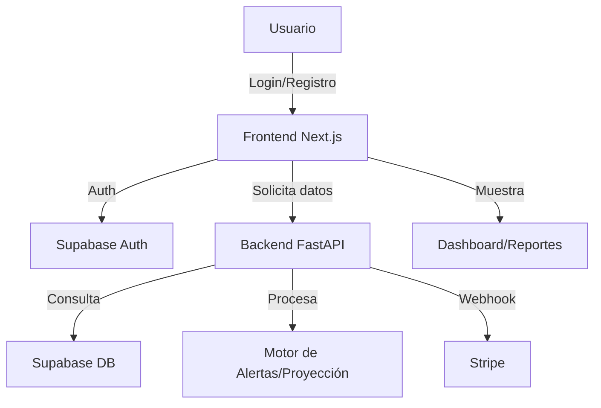
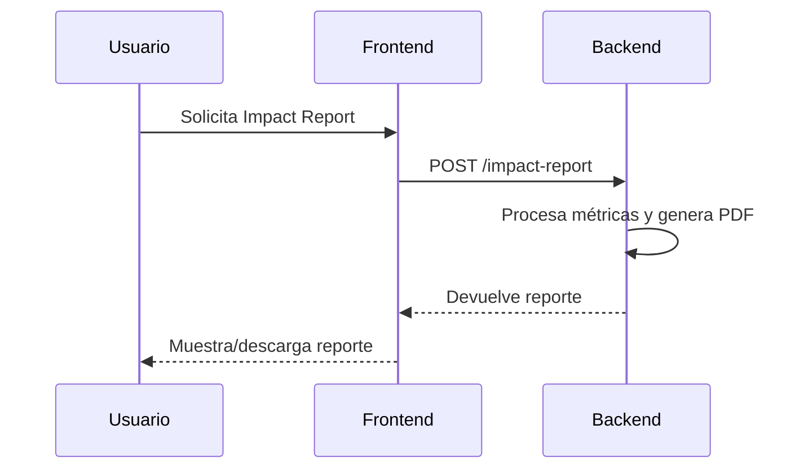
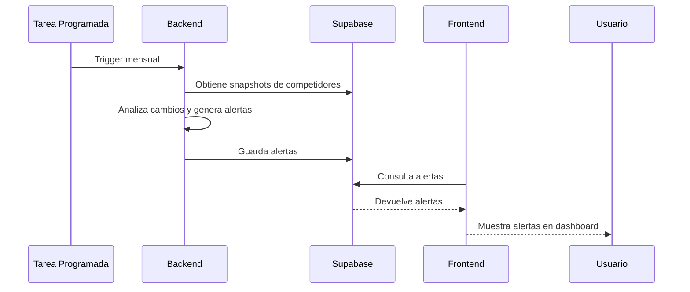

# Diagramas de Flujo y Ejemplos Visuales

## 1. Diagrama de Flujo General del Sistema

---

## 2. Flujo de Generación de Reporte de Impacto

---

## 3. Flujo de Alertas Competitivas

---

## 4. Ejemplo Visual de Dashboard Premium

*Nota: Puedes reemplazar la URL por una imagen propia del dashboard si la tienes.*

---

## 5. Recomendaciones para Diagramas
- Usa Mermaid para diagramas de flujo y secuencia en Markdown.
- Usa herramientas como Lucidchart, Whimsical o Figma para diagramas visuales avanzados.
- Guarda imágenes de ejemplo en la carpeta `docs/` y enlázalas en la documentación.

---

Este archivo puede ampliarse con más diagramas y ejemplos visuales según evolucione el sistema.
