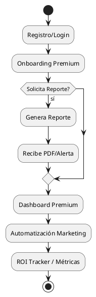
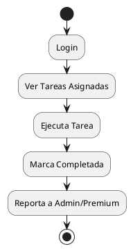
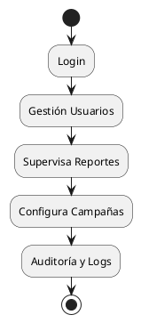

# Flujos de Negocio y Usuario Lokigi (2025)

## 1. Tipos de Usuario
- **Premium:** Acceso completo a dashboards, growth, alertas, PDF, marketing automation, ROI tracker, dark mode, mobile-first.
- **Worker:** Usuario operativo, acceso a tareas asignadas, reportes limitados, sin acceso a configuración avanzada.
- **Admin:** Control total, gestión de usuarios, clientes, reportes, alertas, configuración y auditoría.

---

## 2. Flujos de Negocio

### a) Registro y Onboarding
1. Usuario accede a landing pública.
2. Se registra vía email/Supabase Auth.
3. Selecciona tipo de usuario (Premium, Worker, Admin).
4. Onboarding guiado según rol.

### b) Generación de Reporte de Impacto (Premium)
1. Premium solicita auditoría.
2. Backend ejecuta análisis (growth, alertas, lead scoring).
3. Se genera PDF y dashboard interactivo.
4. Usuario recibe notificación y acceso al reporte.

### c) Dashboard Premium
1. Acceso solo para Premium.
2. Visualización de heatmap, alertas, ROI tracker.
3. Growth projection y reportes descargables.

### d) Automatización de Marketing (Premium/Admin)
1. Configura campañas.
2. Generación automática de links, mensajes y seguimiento.
3. QA Automation valida links, I18n y tracking de conversión.
4. Resultados y métricas en dashboard.

### e) Worker Flow
1. Worker recibe tarea asignada (ej: seguimiento, validación, soporte).
2. Accede a reportes limitados y herramientas de ejecución.
3. Marca tareas como completadas.
4. Admin/premium revisa desempeño.

### f) Admin Flow
1. Admin gestiona usuarios (alta/baja, permisos).
2. Supervisa reportes, auditorías y alertas.
3. Configura parámetros globales y campañas.
4. Acceso a logs, métricas y auditoría avanzada.

---

## 3. Diagramas de Flujo

### a) Premium
```
[Inicio]
   |
[Registro/Login]
   |
[Onboarding Premium]
   |
[Solicita Reporte]---No--->[Dashboard]
   | Sí
[Genera Reporte]
   |
[Recibe PDF/Alerta]
   |
[Dashboard Premium]
   |
[Automatización Marketing]
   |
[ROI Tracker / Métricas]
   |
[Fin]
```

### b) Worker
```
[Inicio]
   |
[Login]
   |
[Ver Tareas Asignadas]
   |
[Ejecuta Tarea]
   |
[Marca Completada]
   |
[Reporta a Admin/Premium]
   |
[Fin]
```

### c) Admin
```
[Inicio]
   |
[Login]
   |
[Gestión Usuarios]
   |
[Supervisa Reportes]
   |
[Configura Campañas]
   |
[Auditoría y Logs]
   |
[Fin]
```

---

## 4. Resumen Visual (PlantUML)

### Premium


### Worker


### Admin


---

## 5. Notas de Implementación
- Todos los flujos están cubiertos por QA Automation y CI/CD.
- Los diagramas pueden visualizarse con PlantUML o Markdown compatible.
- Ver archivos de backend/frontend para detalles técnicos de cada flujo.

---
Última actualización: 2025-12-29
