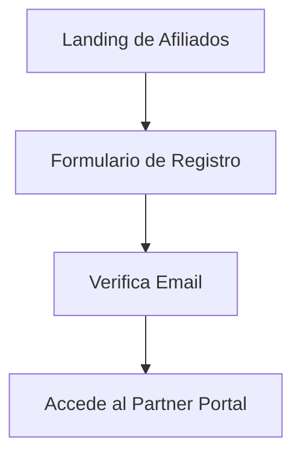
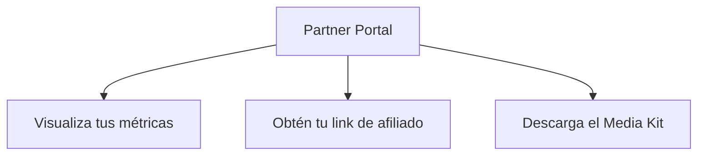
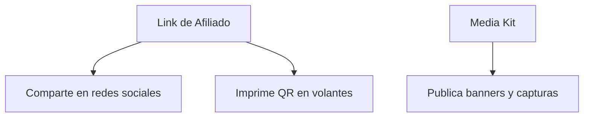
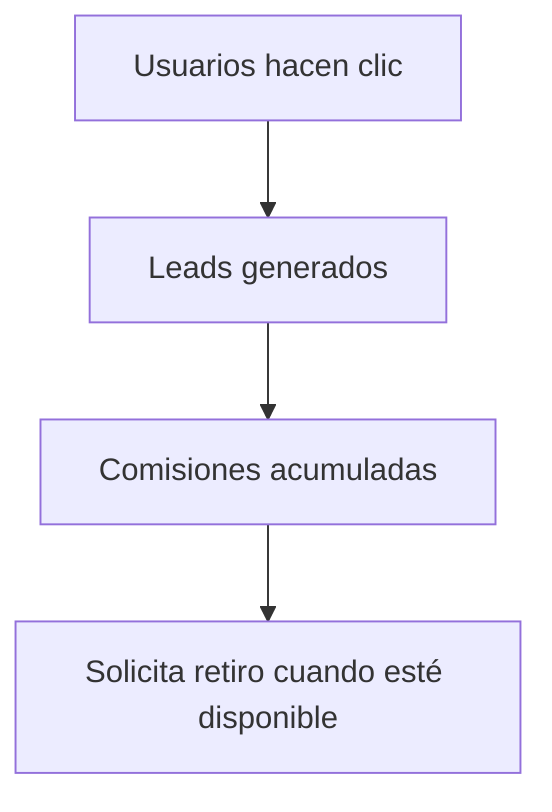

# Guía Visual de Onboarding para Afiliados Lokigi

---

## 1. Registro y Acceso

- Accede a la landing de afiliados desde el menú principal o invitación.
- Completa el formulario de registro (nombre, email, contraseña).
- Recibe un email de verificación y activa tu cuenta.
- Ingresa al Partner Portal con tus credenciales.

---

## 2. Primeros Pasos en el Partner Portal

- Visualiza tus métricas clave: Clics, Leads, Comisiones.
- Copia tu link de afiliado y genera tu QR para compartir.
- Descarga banners y materiales del Media Kit para tus redes.

---

## 3. Compartir y Promocionar

- Comparte tu link en WhatsApp, Facebook, Instagram, etc.
- Imprime el QR para eventos o flyers físicos.
- Publica banners y capturas de antes/después en tus canales.

---

## 4. Seguimiento y Comisiones

- Monitorea en tiempo real tus clics, leads y comisiones.
- Cuando tus comisiones estén disponibles, solicita el retiro desde el portal.

---

## 5. Soporte y Actualizaciones

- Accede a la sección de ayuda para resolver dudas.
- Recibe notificaciones de nuevos materiales y campañas.
- Contacta al equipo Lokigi para soporte personalizado.

---

> **Tip:** ¡Mientras más compartas tu link y materiales, más oportunidades de ganar tendrás!

---

Última actualización: 2025-12-29
